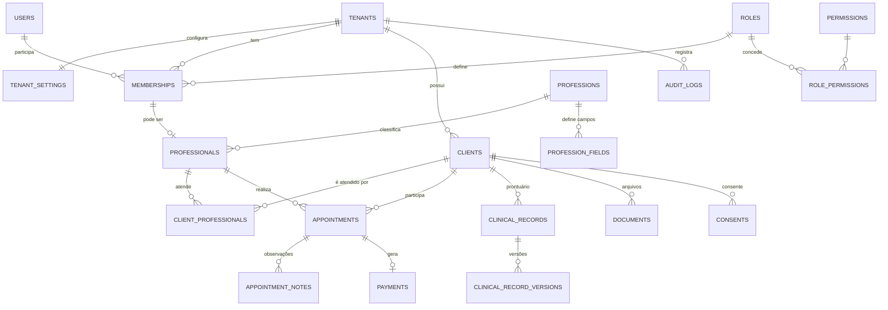
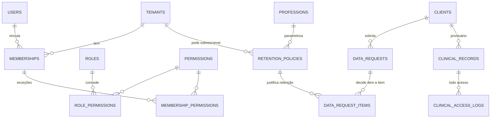

# Vortexis Clinic — Arquitetura (Etapa 2)

**Status:** seções 1–11 são a análise aprovada na Etapa 2. As seções 12–17 foram
atualizadas depois da **Etapa 2.1** (preparação do front).

Na **Etapa 3** a fundação saiu do papel: projeto `Apivortexisclinic` (FastAPI),
banco MySQL com migrations, autenticação com sessão opaca, memberships, RBAC e
contexto de tenant fail-closed.

Na **Etapa 4** entraram os dois primeiros módulos de produto: **pessoas
atendidas** e **agenda/atendimentos**, com FK composta por tenant, escopo de
dados (`all`/`own`), conflito de horário resolvido em transação e a camada de
domínio do servidor como fonte única dos números. O financeiro passou a ser
real **em leitura** (deriva dos atendimentos).

Na **Etapa 5** o financeiro ganhou livro-caixa: a tabela `payments`, com baixa,
estorno e isenção. Duas decisões saíram daí — "recebido" passou a ser **regime
de caixa** (soma pela data em que o dinheiro entrou, não pela do atendimento) e
estorno **marca** o lançamento em vez de apagar. Prontuário e documentos
**continuam fora do banco**. Detalhes de execução no README da API.
Stack decidida: **FastAPI (Python) + MySQL** no backend, **front em JS puro** por enquanto.

Índice: [1. Atual](#1-arquitetura-atual-encontrada) · [2. Proposta](#2-arquitetura-proposta) ·
[3. Pastas](#3-estrutura-de-pastas-recomendada) · [4. Entidades](#4-entidades-necessárias) ·
[5. Relacionamentos](#5-relacionamentos) · [6. Multi-tenant](#6-modelo-multi-tenant) ·
[7. Autenticação](#7-estratégia-de-autenticação) · [8. Autorização](#8-estratégia-de-autorização) ·
[9. Papéis](#9-papéis-e-permissões) · [10. MySQL](#10-modelo-conceitual-mysql) ·
[11. Dados sensíveis](#11-dados-sensíveis) · [12. Riscos](#12-riscos-de-segurança) ·
[13. Mudanças](#13-mudanças-necessárias-no-projeto-atual) · [14. Plano](#14-plano-de-implementação) ·
[15. Isolamento](#15-regras-de-isolamento-vigentes) ·
[16. Administrativo × clínico](#16-dados-administrativos--dados-clínicos) ·
[17. Modelo atualizado](#17-modelo-de-dados-atualizado-etapa-21)

---

## 1. Arquitetura atual encontrada

Levantamento do código em `Appvortexisclinic` (27 arquivos, ~3.650 linhas):

| Camada | Arquivos | Linhas | Situação |
|---|---:|---:|---|
| `assets/css` | 5 | 1.044 | Tokens + layout + componentes. Sem acoplamento ao domínio. |
| `assets/js/core` | 6 | 370 | dom, format, store, session, router, toast. |
| `assets/js/services` | 5 | 409 | Única porta de acesso a dados. |
| `assets/js/components` | 3 | 411 | ui (blocos), shell (navegação), modal. |
| `assets/js/views` | 6 | 1.176 | Uma por área. |
| `assets/js/data` | 1 | 169 | Mock centralizado. |
| `assets/js/config` | 1 | 70 | Navegação, flags, API. |

**O que já está no lugar certo**

- Views nunca leem o mock: `VC.mock` aparece **15×** nos services e **1×** fora (um único ponto em Configurações, que lê preferências — precisa virar service).
- Toda leitura passa por `VC.session.tenantId()` e filtra por tenant (`services/base.js`). É simulação, mas o formato da chamada já é o definitivo.
- Navegação, cor por vertical e termos já saem de configuração, não de código espalhado.
- Service worker não cacheia dados — só CSS/JS/imagens.

**O que vai atrapalhar (e por que)**

| Ponto | Onde | Problema | Gravidade |
|---|---|---|---|
| Profissão fixa | 3 pontos: `shell.js:47` ("· Psicologia"), `app.config.js:12`, `session.js:26` | Rótulo e vertical vêm de constante, não do tenant | Baixa — fácil de corrigir |
| Termos fixos | views/componentes: "paciente" 54×, "Paciente" 24×, "atendimento" 47×, "Atendimento" 20× | Trocar para "cliente"/"sessão" exigiria caçar string | **Alta** — cresce a cada tela nova |
| Regra de negócio na view | `dashboard.js` 8 `filter/reduce`, `agenda.js` 5, `pacientes.js` 3 | Cálculo de presença, total do dia e receita moram na UI. Com backend, o mesmo número pode divergir entre tela e relatório | **Alta** |
| HTML por concatenação | todas as views | Um campo que escape do `esc()` vira XSS. Hoje há disciplina, mas não há garantia estrutural | **Alta** (com dado real) |
| Idioma misturado | código em PT, entidades pedidas em EN | `pacientes.service.js` falando com `/clients` confunde | Média |
| Sem tipos | JS puro | Validação precisará ser duplicada (front + back). Aceitável; o backend é a fonte da verdade | Média |

**Recomendação antes de qualquer refatoração:** não mexer no design nem reescrever telas. As correções 2, 3 e 4 da tabela são cirúrgicas e cabem no começo da Etapa 2, arquivo por arquivo.

---

## 2. Arquitetura proposta

Três aplicações separadas, um banco:

```
┌────────────────────────┐   ┌────────────────────────┐   ┌────────────────────────┐
│ vortexisclinic.com.br  │   │ app.vortexisclinic...  │   │ admin.vortexisclinic.. │
│ site institucional     │   │ painel do profissional │   │ painel interno VORTEXIS│
│ (estático, pronto)     │   │ (JS puro, PWA)         │   │ (separado, etapa 7)    │
└────────────────────────┘   └───────────┬────────────┘   └───────────┬────────────┘
                                         │ HTTPS + cookie de sessão   │ auth própria
                              ┌──────────▼────────────────────────────▼──────────┐
                              │  API FastAPI                                     │
                              │  ┌────────────────────────────────────────────┐  │
                              │  │ api/       rotas, schemas de entrada/saída │  │
                              │  │ services/  regras de negócio               │  │
                              │  │ repos/     acesso a dados (sempre escopado)│  │
                              │  │ security/  auth, permissões, auditoria     │  │
                              │  └────────────────────────────────────────────┘  │
                              └──────────────────────┬───────────────────────────┘
                                                     │ SQLAlchemy (sessão com tenant fixo)
                                        ┌────────────▼────────────┐
                                        │ MySQL 8 — base única    │
                                        │ tenant_id em tudo       │
                                        └─────────────────────────┘
```

**Regras que a arquitetura precisa garantir, não só recomendar:**

1. Nenhuma rota recebe `tenant_id`. Ele sai da sessão do usuário, no servidor.
2. Nenhum repositório consulta sem escopo — o filtro é aplicado na sessão do ORM, não em cada query.
3. Nenhuma view do front decide o que pode ser visto. Ela esconde botão; o backend nega o dado.
4. Registro clínico não trafega em endpoint de listagem. Só por acesso direto, autorizado e auditado.

**Camadas (backend), com a fronteira entre elas:**

| Camada | Pode | Não pode |
|---|---|---|
| `api/` (rotas) | validar entrada, chamar service, montar resposta | conter regra de negócio, tocar no ORM |
| `services/` | regra de negócio, orquestração, transação | conhecer HTTP, montar SQL bruto |
| `repositories/` | consultas, escrita, paginação | decidir permissão |
| `security/` | identidade, permissão, escopo, auditoria | conhecer regra de agenda/financeiro |
| `models/` | mapeamento ORM, restrições | lógica |

---

## 3. Estrutura de pastas recomendada

```
Vortexisclinic/
├── Sitevortexisclinic/          # institucional (pronto)
├── Appvortexisclinic/           # painel do profissional (atual)
│   ├── assets/js/
│   │   ├── core/                # + http.js (cliente da API), terms.js (terminologia)
│   │   ├── services/            # mesmos nomes, agora falando com a API
│   │   ├── models/              # NOVO: normaliza payload da API → formato das telas
│   │   ├── components/ views/ config/
│   └── docs/
└── Apivortexisclinic/           # NOVO — backend
    ├── app/
    │   ├── main.py
    │   ├── core/                # config, logging, exceções, hora/fuso
    │   ├── db/                  # engine, sessão com tenant, base declarativa
    │   ├── models/              # ORM: tenant.py, user.py, client.py, appointment.py…
    │   ├── schemas/             # Pydantic: entrada e saída (contrato da API)
    │   ├── repositories/        # acesso a dados, sempre escopado
    │   ├── services/            # regras: agenda, financeiro, prontuário, onboarding
    │   ├── security/            # senhas, sessões, permissões, escopo, auditoria
    │   ├── api/v1/              # rotas por recurso
    │   ├── validators/          # regras de domínio reutilizáveis (conflito de horário…)
    │   └── platform/            # área da VORTEXIS (staff) — módulo isolado
    ├── migrations/              # Alembic
    ├── tests/
    │   ├── test_tenant_isolation.py   # obrigatório desde o dia 1
    │   └── test_permissions.py
    └── docker-compose.yml       # MySQL local
```

**Convenção de idioma:** banco, ORM, schemas e rotas em **inglês** (`clients`, `appointments`). Front e textos de tela em **português**. A tradução acontece na borda — no `models/` do front e no dicionário de termos.

---

## 4. Entidades necessárias

> Atualizado na Etapa 2.1: `retention_policies`, `data_request_items` e
> `clinical_access_logs` entraram na lista — ver §17.

### Globais (fora do tenant)

| Entidade | Para quê | Observação |
|---|---|---|
| `professions` | catálogo de profissões | seed: psicólogo, psicanalista, terapeuta ocupacional, terapeuta integrativo, nutricionista… |
| `profession_fields` | campos extras por profissão | define se pede conselho/registro e o rótulo ("CRP", "CREFITO") |
| `plans` | planos comerciais | limites: profissionais, clientes, armazenamento |
| `platform_users` | equipe VORTEXIS | **tabela separada de `users`** |
| `platform_audit_logs` | ações da equipe VORTEXIS | inclusive tentativa de acesso a tenant |

### Do tenant

| Entidade | Para quê |
|---|---|
| `tenants` | a conta: autônomo, consultório ou clínica |
| `tenant_settings` | terminologia, fuso, moeda, jornada padrão, política de retenção |
| `subscriptions` | plano vigente, status, período (modelar agora, usar depois) |
| `users` | credencial de acesso (pessoa que faz login) |
| `memberships` | vínculo usuário ↔ tenant ↔ papel ↔ escopo de dados |
| `roles`, `permissions`, `role_permissions` | RBAC |
| `membership_permissions` | exceções por pessoa (concede ou revoga) |
| `professionals` | perfil profissional: profissão, registro, especialidades, modalidades |
| `professional_schedules` | jornada e bloqueios por profissional |
| `clients` | pessoa atendida (rótulo na tela: paciente/cliente) |
| `client_professionals` | quem atende quem — base do escopo "só os meus" |
| `appointments` | agendamento/atendimento |
| `appointment_notes` | observação **operacional** (chegou atrasado, remarcou) |
| `clinical_records` | registro clínico — conteúdo cifrado, versionado |
| `clinical_record_versions` | histórico imutável de retificações |
| `documents` | arquivos, com classificação de sensibilidade |
| `payments` | recebimento ligado (ou não) a um atendimento |
| `notifications` | avisos internos |
| `consents` | consentimento do titular (versão do termo, data, revogação) |
| `data_requests` | pedidos LGPD: acesso, correção, exclusão |
| `audit_logs` | quem viu/alterou o quê, quando, de onde |

**Profissão configurável, sem `if` no código:**

```
professions
  id, slug, name, requires_council (bool), council_label, registration_label,
  default_terminology (JSON), active

profession_fields
  id, profession_id, key, label, type, required, options (JSON), order
```

O formulário de perfil é montado a partir de `profession_fields`. Uma profissão sem conselho simplesmente não traz esses campos — nada no código precisa saber que "psicólogo tem CRP".

**Terminologia configurável:**

```
tenant_settings.terminology = {
  "client.singular": "Paciente", "client.plural": "Pacientes",
  "appointment.singular": "Sessão", "appointment.plural": "Sessões"
}
```

Padrão vem da profissão; o tenant sobrescreve. No front, um único helper `VC.t("client.plural")` — é o que substitui as ~145 strings fixas de hoje.

---

## 5. Relacionamentos



**Cardinalidades que definem o produto:**

- `users ↔ tenants` é **N:N** via `memberships`. Um terapeuta pode atender em consultório próprio e numa clínica, com papéis diferentes. Sem isso, ele precisaria de dois e-mails.
- `memberships → professionals` é 0..1: recepcionista tem membership e **não** tem perfil profissional.
- `clients → tenant` é 1:N: o mesmo CPF em duas clínicas são dois registros. É o correto — prontuário não se compartilha entre tenants.
- `appointments → professional` é obrigatório: todo atendimento tem dono, e é isso que sustenta o escopo "só os meus".
- `clinical_records → professional` guarda o **autor**, que não muda nunca, mesmo se ele sair da clínica.

---

## 6. Modelo multi-tenant

**Escolha: base única, `tenant_id` em todas as tabelas de negócio.** Base por cliente seria mais isolada, mas inviabiliza migração e custo num SaaS pequeno. O isolamento vem de quatro camadas somadas:

**Camada 1 — identidade.** A sessão guarda `user_id` + `tenant_id ativo`. Endpoint nenhum aceita tenant do cliente. Trocar de tenant é uma ação explícita (`POST /session/tenant`) que revalida a membership.

**Camada 2 — sessão do ORM escopada.** Não confiar em lembrar do `WHERE`:

```python
# db/session.py  (conceito)
@event.listens_for(Session, "do_orm_execute")
def apply_tenant_filter(state):
    if state.is_select and not state.execution_options.get("skip_tenant_filter"):
        tenant_id = current_tenant.get()          # contextvar da requisição
        if tenant_id is None:
            raise RuntimeError("consulta sem tenant no contexto")
        state.statement = state.statement.options(
            with_loader_criteria(TenantMixin, lambda cls: cls.tenant_id == tenant_id,
                                 include_aliases=True)
        )
```

Toda entidade de negócio herda `TenantMixin`. Consulta sem tenant no contexto **falha**, em vez de devolver tudo.

**Camada 3 — banco.** Chave composta impede referência cruzada entre tenants:

```sql
UNIQUE KEY uq_client_tenant (tenant_id, id),

CONSTRAINT fk_appt_client FOREIGN KEY (tenant_id, client_id)
  REFERENCES clients (tenant_id, id)
```

Assim, um `appointment` do tenant A **não consegue** apontar para um `client` do tenant B, mesmo que alguém erre na aplicação.

**Camada 4 — teste.** `tests/test_tenant_isolation.py` roda todo endpoint duas vezes: com o dono e com um usuário de outro tenant, exigindo 404 (não 403 — 403 confirma que o registro existe). Esse teste entra antes da primeira rota de negócio.

---

## 7. Estratégia de autenticação

| Item | Decisão | Por quê |
|---|---|---|
| Senha | Argon2id (fallback bcrypt custo 12) | padrão atual para senha |
| Sessão | **opaca no servidor**, tabela `sessions`, cookie `HttpOnly; Secure; SameSite=Lax` | JWT em localStorage é XSS na veia; sessão opaca permite **revogar na hora** — essencial com dado de saúde |
| Expiração | 12h inativo / 7 dias absoluto, renovação deslizante | equilíbrio entre consultório e segurança |
| Cadastro | e-mail + verificação obrigatória antes de criar dado de cliente | evita conta fantasma com prontuário |
| Recuperação | token aleatório 32 bytes, **hash** no banco, uso único, 30 min, resposta sempre igual | não permite descobrir se o e-mail existe |
| Após redefinir | invalida todas as sessões daquele usuário | senha trocada = sessão antiga morre |
| Rate limit | login, reset e verificação por IP + por conta | trava força bruta |
| 2FA | tabela e campos preparados, TOTP opcional | ligar quando houver clínicas maiores |
| Troca de tenant | endpoint próprio, revalida membership, registra em auditoria | |

Fluxo: `POST /auth/login` → valida → cria `sessions` → cookie. `GET /auth/me` devolve usuário, tenant ativo, papel, permissões e terminologia — é o que o front usa para montar a interface.

---

## 8. Estratégia de autorização

Três perguntas, sempre nesta ordem, em **toda** requisição:

1. **Autenticado?** sessão válida → senão 401.
2. **Pertence ao tenant?** membership ativa → senão 404.
3. **Pode a ação e alcança o dado?** permissão + escopo → senão 403 (ou 404 quando revelar existência já é vazamento).

```python
@router.get("/clients/{client_id}")
def get_client(
    client_id: str,
    ctx = Depends(require("client.read")),     # 1 e 3 (permissão)
    service: ClientService = Depends(),
):
    return service.get(client_id, ctx)         # 2 e 3 (escopo) dentro do service
```

**Escopo de dados** (`memberships.data_scope`), além do papel:

- `all` — enxerga todos os clientes do tenant (dono de clínica, recepção).
- `own` — só os clientes vinculados a ele em `client_professionals` (padrão do profissional).

**Regra especial do registro clínico:** permissão de leitura pertence ao **autor**, não ao cargo. O dono da clínica **não** lê prontuário de outro profissional por padrão. Liberar exige ação explícita, registrada e temporária (cobertura de férias, por exemplo). É o que o sigilo profissional espera — e é uma decisão que vale você confirmar com o conselho da sua primeira vertical.

---

## 9. Papéis e permissões

| Papel | Escopo padrão | Resumo |
|---|---|---|
| `OWNER` | all | administra conta, usuários, plano e financeiro. **Não** lê prontuário alheio. |
| `PROFESSIONAL` | own | agenda, clientes, atendimentos e prontuário **dos seus**. Financeiro próprio. |
| `ASSISTANT` | all (sem clínico) | agenda, cadastro e financeiro. **Nunca** prontuário. |

Permissões granulares (chave `recurso.ação`):

```
agenda.read        agenda.write        agenda.manage_others
client.read        client.write        client.archive
appointment.read   appointment.write   appointment.cancel
finance.read       finance.write       finance.export
clinical.read      clinical.write      clinical.read_others   ← nunca no ASSISTANT
document.read      document.write
user.manage        settings.manage     audit.read
data_request.manage
```

Matriz inicial (seed em `role_permissions`):

| Permissão | OWNER | PROFESSIONAL | ASSISTANT |
|---|:--:|:--:|:--:|
| agenda.read / write | ✔ | ✔ (own) | ✔ |
| client.read / write | ✔ | ✔ (own) | ✔ |
| appointment.* | ✔ | ✔ (own) | ✔ |
| finance.read / write | ✔ | próprio | ✔ |
| clinical.read / write | — | ✔ (own) | — |
| clinical.read_others | por concessão | por concessão | — |
| user.manage / settings.manage | ✔ | — | — |
| audit.read | ✔ | — | — |

`membership_permissions` permite exceção pontual (`grant` ou `deny`), com validade e motivo — é assim que se cobre férias sem promover ninguém a dono.

---

## 10. Modelo conceitual MySQL

> As tabelas abaixo continuam valendo. O **delta** da Etapa 2.1 (memberships com
> `professional_id`, `membership_permissions` com motivo e validade,
> `retention_policies`, `data_requests` item a item, `clinical_access_logs`)
> está na §17.

**Convenções:** InnoDB · `utf8mb4` / `utf8mb4_0900_ai_ci` · datas em **UTC** (`DATETIME(3)`), fuso fica no tenant · dinheiro em `DECIMAL(10,2)` (nunca float) · PK `BIGINT UNSIGNED AUTO_INCREMENT` interna + `public_id CHAR(26)` (ULID) para URLs — id sequencial exposto entrega volume de negócio e facilita enumeração.

Esboço das tabelas centrais (conceitual, **não é migration**):

```sql
tenants
  id, public_id, name, type ENUM('solo','office','clinic'), slug UNIQUE,
  status ENUM('trial','active','past_due','suspended','cancelled'),
  plan_id, timezone, created_at, deleted_at

users
  id, public_id, email UNIQUE, password_hash, name,
  status ENUM('pending','active','blocked'), email_verified_at,
  last_login_at, created_at
  -- sem tenant_id: o vínculo é a membership

memberships
  id, tenant_id, user_id, role_id,
  data_scope ENUM('all','own') DEFAULT 'own',
  status ENUM('invited','active','suspended'),
  UNIQUE (tenant_id, user_id),
  INDEX (user_id, status)

professionals
  id, public_id, tenant_id, membership_id NULL, profession_id,
  display_name, council NULL, registration_number NULL,
  specialties JSON, modalities JSON, custom_fields JSON, active,
  UNIQUE (tenant_id, id)

clients
  id, public_id, tenant_id, name, email NULL, phone NULL, birth_date NULL,
  guardian JSON NULL, status ENUM('active','inactive','archived'),
  created_by_user_id, created_at, anonymized_at NULL,
  UNIQUE (tenant_id, id),
  INDEX (tenant_id, status, name),
  INDEX (tenant_id, created_at)

client_professionals
  tenant_id, client_id, professional_id, is_primary, started_at, ended_at NULL,
  PRIMARY KEY (tenant_id, client_id, professional_id)

appointments
  id, public_id, tenant_id, client_id, professional_id,
  start_at DATETIME(3), duration_min SMALLINT, end_at (gerada),
  modality ENUM('in_person','online'),
  status ENUM('scheduled','confirmed','done','no_show','cancelled'),
  price DECIMAL(10,2), payment_status ENUM('pending','paid','waived'),
  cancelled_reason NULL, created_by_user_id, created_at, updated_at,
  UNIQUE (tenant_id, id),
  INDEX (tenant_id, start_at),
  INDEX (tenant_id, professional_id, start_at),   -- agenda e conflito de horário
  INDEX (tenant_id, client_id, start_at),
  INDEX (tenant_id, payment_status, start_at),    -- pendências
  FOREIGN KEY (tenant_id, client_id) REFERENCES clients (tenant_id, id)

clinical_records
  id, public_id, tenant_id, client_id, author_professional_id,
  appointment_id NULL, kind ENUM('session','evolution','assessment','referral'),
  content_encrypted VARBINARY, content_iv, key_version,
  created_at, locked_at NULL, deleted_at NULL,
  UNIQUE (tenant_id, id),
  INDEX (tenant_id, client_id, created_at)
  -- sem índice no conteúdo: não se busca dentro de prontuário

payments
  id, tenant_id, client_id, appointment_id NULL, amount DECIMAL(10,2),
  method ENUM('pix','card','cash','transfer','other'),
  status ENUM('pending','paid','refunded','waived'),
  due_date, paid_at NULL, created_by_user_id,
  INDEX (tenant_id, status, due_date), INDEX (tenant_id, paid_at)

audit_logs
  id, tenant_id NULL, actor_type ENUM('user','platform','system'),
  actor_id, action, entity, entity_id, ip VARBINARY(16), user_agent,
  meta JSON, created_at,
  INDEX (tenant_id, created_at), INDEX (tenant_id, entity, entity_id)
  -- append-only: usuário da aplicação sem GRANT de UPDATE/DELETE
```

**Regras de integridade que valem citar:** conflito de horário é restrição de negócio (sobreposição), não `UNIQUE` — validar em `validators/schedule.py` dentro de transação com `SELECT ... FOR UPDATE` na agenda daquele profissional; exclusão é sempre lógica (`deleted_at`) exceto no fluxo de LGPD; `clinical_records` não se altera — retificação cria versão nova.

---

## 11. Dados sensíveis

A LGPD trata dado de saúde como **sensível** (art. 5º, II). Na prática, aqui:

| Nível | O que | Consequência na arquitetura |
|---|---|---|
| **Sensível por natureza** | `clinical_records`, documentos clínicos, motivo de encaminhamento | cifra na aplicação, acesso só do autor, todo acesso auditado, nunca em listagem, nunca em cache, nunca em log |
| **Sensível por associação** | nome/contato do cliente, agenda, vínculo cliente↔profissional | ser paciente de terapeuta **já é** dado de saúde. Por isso a lista de pacientes tem o mesmo cuidado do prontuário na hora de exportar, logar ou cachear |
| **Pessoal comum** | dados do profissional, financeiro, preferências | proteção padrão |
| **Operacional** | audit_logs, sessões | retenção própria, sem conteúdo clínico dentro |

Decisões que derivam disso: cifra do conteúdo clínico com chave por tenant derivada de chave-mestra (`key_version` já na tabela para permitir rotação); nenhum dado de cliente em `localStorage`/IndexedDB; o "modo discreto" do front continua sendo conforto visual, não controle de acesso; exportação de relatório sai do servidor com marca d'água de quem gerou e fica registrada.

---

## 12. Riscos de segurança

Coluna **Status**: o que a Etapa 2.1 já resolveu no front e o que continua
dependendo do backend. Nenhuma correção de front substitui a do servidor —
elas se somam.

| # | Risco | Como mitigar | Status |
|---|---|---|---|
| 1 | **Vazamento entre tenants** por query sem filtro | filtro na sessão do ORM + FK composta + teste de isolamento por endpoint | **Front: feito** (fail-closed em `services/base.js`, tenant só do usuário autenticado). Backend: pendente |
| 2 | **XSS no painel** — o front montava HTML por concatenação; um `esc()` esquecido com dado real viraria execução de script | saída escapada por construção + CSP sem `unsafe-inline` + sanitização no backend na escrita | **Front: feito** (`core/safe.js`: o template `html` escapa toda interpolação; `render()` recusa string crua). CSP e backend: pendentes |
| 3 | **IDOR** ao trocar id na URL | busca sempre escopada; 404 em vez de 403 quando existir já vaza | **Front: feito** (`base.exigir()` devolve `nao_encontrado`). Backend: pendente |
| 4 | **Dado clínico em cache do PWA** | service worker nunca intercepta `/api`; limpar caches no logout; sem armazenamento local de resposta | Parcial: bypass de `/api` confirmado; limpeza no logout entra com o login real |
| 5 | **Log com conteúdo sensível** | lista de campos proibidos no logger; log estruturado sem corpo de requisição em rotas clínicas | Pendente (backend) |
| 6 | **Staff da VORTEXIS lendo prontuário** | banco separado de credenciais, API separada, usuário MySQL do painel interno **sem SELECT** em `clinical_records`/`documents`; suporte só com acesso temporário concedido pelo tenant e registrado | Pendente (backend) — regra já escrita na §16 |
| 7 | **Gestão da chave de cifra** | chave-mestra fora do repositório (variável de ambiente/KMS), `key_version` para rotação, backup da chave separado do backup do banco | Pendente (backend) |
| 8 | **Backup vira o ponto fraco** | backup cifrado, restauração testada, retenção definida, acesso ao backup auditado | Pendente (infra) |
| 9 | **Enumeração de contas** no cadastro/reset | resposta idêntica para e-mail existente ou não; rate limit | Pendente (backend) |
| 10 | **Sessão sobrevivendo a desligamento** | sessão opaca revogável, expiração absoluta, logout global ao trocar senha | Pendente (backend) |
| 11 | **Conflito LGPD × guarda de prontuário** | exclusão = anonimizar cadastro e **reter** o registro clínico pelo prazo, com justificativa registrada. Prazo **parametrizável** (§17), nunca fixo no código | Modelado (§17). Prazo a confirmar no conselho antes de semear |
| 12 | Escalonamento por permissão mal semeada | `role_permissions` versionado em migration; teste que garante `ASSISTANT` sem `clinical.*` | **Front: feito** (matriz em `types/entities.js` + teste). Backend: pendente |
| 13 | **Termo de tenant carregando marcação** (rótulo configurável virando vetor) | termo é rótulo curto: só texto, sem marcação, aspas, crase, barra invertida ou chaves, até 40 caracteres, chave desconhecida recusada | **Front: feito** (`core/terms.js`, com teste). Backend valida de novo na escrita |
| 14 | **Divergência de número entre tela e relatório** (cada lugar calculando do seu jeito) | cálculo em uma única camada de domínio, reaproveitada por tela, relatório e, depois, backend | **Front: feito** (`domain/metrics.js`) |

---

## 13. Mudanças necessárias no projeto atual

Nenhuma tocou no design. Situação depois da Etapa 2.1:

| # | Mudança | Arquivos | Status |
|---|---|---|---|
| 1 | Camada de terminologia com `t()` + dicionário padrão, por profissão e por tenant | `core/terms.js` (novo) + todas as views e componentes | **Feito** |
| 2 | Tirar "Psicologia" fixo; vertical e rótulos vêm do tenant | `shell.js`, `app.config.js`, `session.js` | **Feito** (`verticalPadrao` + `session.aplicarContexto()`) |
| 3 | Tirar `filter/reduce` das views; cálculo numa camada só | `domain/metrics.js` (novo) + services + views | **Feito** |
| 4 | Saída de HTML segura por construção, no lugar de concatenação | `core/safe.js` (novo) + todas as views/componentes | **Feito** |
| 5 | Tipos e contratos de User, Tenant, Membership, Role, Permission | `types/entities.js` (novo) | **Feito** |
| 6 | Estrutura de seleção de tenant/workspace | `session.js`, `shell.js`, `app.js` | **Feito** (troca explícita, revalidada) |
| 7 | `core/http.js`: fetch com cookie, tratamento de 401/403/422, timeout | novo | Parcial — `base.requisitar()` já tem o formato; vira arquivo próprio na etapa do login |
| 8 | `session.js` deixa de ser fixo e passa a ler `GET /auth/me` | 1 arquivo | Preparado — `carregar()` já é assíncrono e tem o ponto de troca marcado |
| 9 | `models/` no front: normaliza payload da API | novo | Pendente (entra com a API) |
| 10 | Renomear domínio no código para inglês (`clients`, `appointments`) | services/views | Pendente — decisão 5 aprovada, execução junto da API |
| 11 | Service worker: limpar cache no logout; confirmar bypass de `/api` | `service-worker.js` | Parcial — bypass confirmado; limpeza entra com o login |
| 12 | Configurações lendo de service, não do mock | `services/configuracoes.service.js` (novo), `views/basicas.js` | **Feito** |

**O que continuo não recomendando agora:** migrar para framework, trocar o roteador ou reescrever telas. A Etapa 2.1 deixou o front pronto para receber a API sem nenhuma dessas mudanças.

---

## 14. Plano de implementação

Cada etapa termina com algo testável, e para quando você validar.
*(A numeração mudou: a **2.1** agora é a preparação do front, que acabou de ser
entregue; o que era 2.1–2.10 andou uma casa.)*

| Etapa | Entrega | Situação |
|---|---|---|
| **2.0** | Modelo de dados e arquitetura aprovados | **Concluída** |
| **2.1** | Front preparado: terminologia, domínio, saída segura, tipos, seleção de conta, isolamento fail-closed | **Concluída** |
| **2.2** | Projeto `Apivortexisclinic`: FastAPI, config por ambiente, healthcheck, Alembic | **Concluída** (Etapa 3, sem Docker — venv local) |
| **2.3** | Migrations do núcleo: tenants, settings, users, memberships, roles, permissions, professions, professionals | **Concluída** (Etapa 3). `clients`, `client_professionals` e `appointments` entraram na Etapa 4; `retention_policies` fica para a etapa da LGPD |
| **2.4** | Sessão do ORM escopada + `test_tenant_isolation` verde **antes** de qualquer rota de negócio | **Concluída** (Etapa 3) |
| **2.5** | Autenticação: cadastro, login, logout, sessões, reset, rate limit | **Concluída** (Etapa 3; verificação de e-mail pendente) |
| **2.6** | Autorização: dependências de permissão e escopo, `/auth/me`, matriz de papéis testada | **Concluída** (Etapa 3) |
| **2.7** | Front com dados reais: cliente HTTP, `session.js` ligado ao `/auth/me`, telas de entrada | **Concluída** (Etapas 3 e 4) |
| **2.8** | Atendimentos e financeiro completos (conflito de horário, baixa de pagamento) | **Concluída** (Etapas 4 e 5) |
| **2.9** | Registros clínicos e documentos: cifra, versionamento, auditoria de acesso | |
| **2.10** | LGPD operacional: consentimentos, exportação do titular, anonimização, retenção parametrizada | |
| **2.11** | Terminologia e profissão configuráveis ponta a ponta (tela de configurações gravável) | |

Fora desta etapa, como você pediu: pagamentos, assinatura, WhatsApp, lembretes, IA, prontuário completo, deploy e painel interno da VORTEXIS — este último entra depois do 2.10, porque depende da separação de credenciais já estar de pé.

---

## 15. Regras de isolamento (vigentes)

Estas regras valem para o front de hoje e para o backend que vem a seguir.
Quando as duas versões divergirem, **a do servidor manda** — o front só
antecipa o comportamento para não desenhar o que a pessoa não pode usar.

### 15.1 As seis regras

**R1 — O tenant nunca vem do cliente.**
Nenhuma requisição carrega `tenant_id` no corpo, na query ou em cabeçalho.
O tenant sai da sessão autenticada. No front, `base.requisitar()` monta a
chamada sem qualquer campo de tenant e usa `credentials: "include"`; o
servidor resolve o tenant pela sessão e ignora o que vier de fora.

**R2 — Fail-closed.**
Operação escopada sem tenant válido no contexto **falha**; nunca vira consulta
ampla. `VC.session.tenantId()` lança quando não há membership ativa, e
`services/base.ler()` deixa o erro subir sem tocar em coleção nenhuma. No
backend é o mesmo desenho: o filtro do ORM levanta exceção quando o
contextvar está vazio.

**R3 — Escopo na borda, não na tela.**
Nenhuma view lê dado bruto. `doTenant()` é o único caminho para uma coleção, e
ele exige o tenant já validado. O que a tela recebe já está filtrado — esconder
na renderização não é isolamento.

**R4 — Recurso de outro tenant não existe.**
`exigir()` devolve `nao_encontrado` (404), nunca `sem_permissao` (403), para
qualquer id que não pertença ao tenant ativo. 403 confirmaria a existência do
registro, o que já é vazamento. 403 fica reservado para recurso **do próprio
tenant** que a pessoa não pode acessar.

**R5 — Troca de conta é ação explícita e revalidada.**
`session.trocarTenant(id)` só aceita um tenant em que o usuário tenha
membership ativa; qualquer outro valor é recusado com `nao_encontrado`. A troca
reconfigura permissões, escopo e terminologia (`aplicarContexto()`) e, no
backend, será um endpoint próprio que regrava a sessão e registra em auditoria.

**R6 — Permissão do front é conforto, não controle.**
`session.pode()` e as rotas protegidas em `app.js` existem para não oferecer
o que a pessoa não pode fazer. A decisão real é do servidor, que repete a
checagem em toda requisição, inclusive quando o front já filtrou.

### 15.2 Onde cada regra está implementada

| Regra | Front (Etapa 2.1) | Backend (a partir da 2.4) |
|---|---|---|
| R1 | `services/base.js` → `requisitar()` | dependência de sessão resolve o tenant |
| R2 | `core/session.js` → `tenantId()` lança; `base.ler()` rejeita | `do_orm_execute` levanta sem contextvar |
| R3 | `base.doTenant()` / services | `TenantMixin` + `with_loader_criteria` |
| R4 | `base.exigir()` → erro 404 | service devolve 404 para id fora do tenant |
| R5 | `session.trocarTenant()` + seletor no shell | `POST /session/tenant` revalida membership |
| R6 | `session.pode()`, `protegida()` em `app.js` | `Depends(require("..."))` em toda rota |

### 15.3 Como isso é verificado

`tests/run.js` (Node, sem navegador) cobre hoje:

- leitura sem membership ativa **rejeita** e não consulta nada;
- id de outro tenant devolve `nao_encontrado`, não `sem_permissao`;
- trocar para um tenant sem vínculo é recusado;
- depois de trocar de conta, os dados são os da nova conta — e só dela;
- `ASSISTANT` não recebe nenhuma permissão da classe clínica;
- `OWNER` não recebe `clinical.*` pelo papel.

No backend, o mesmo conjunto vira `tests/test_tenant_isolation.py`, rodando
cada endpoint duas vezes — dono e estranho — e exigindo 404 no segundo caso.
Esse teste entra **antes** da primeira rota de negócio.

---

## 16. Dados administrativos × dados clínicos

A conta e o conteúdo clínico são **dois mundos**. Quem administra a conta não
lê prontuário; quem atende lê o seu. Esta separação não é um aviso na tela: ela
está no modelo de permissões, na classificação do dado e no desenho das telas.

### 16.1 Classificação

Quatro classes, declaradas em `types/entities.js` (`DATA_CLASS`) e espelhadas
no backend:

| Classe | O que entra | Quem alcança |
|---|---|---|
| `administrative` | cadastro e contato da pessoa atendida, agenda, presença/falta, valores e pagamentos | papel administrativo e profissional, dentro do escopo (`all` ou `own`) |
| `clinical` | registro de sessão, evolução, avaliação, encaminhamento, documento clínico, observação clínica | **só** quem tem permissão da classe clínica — por padrão, o autor |
| `account` | usuários, papéis, plano, configurações e terminologia do tenant | `OWNER` (e quem ele delegar) |
| `audit` | trilha de acesso e de alteração | `OWNER` e a auditoria da plataforma, sem conteúdo clínico dentro |

O mapa classe → permissões está em `CLASS_PERMISSIONS`. Vale a regra: **nenhuma
permissão administrativa alcança a classe clínica**. Não existe permissão
"total"; existe conjunto.

### 16.2 O que cada papel enxerga

| | `administrative` | `clinical` | `account` | `audit` |
|---|:--:|:--:|:--:|:--:|
| `OWNER` | ✔ (conta toda) | **—** | ✔ | ✔ |
| `PROFESSIONAL` | ✔ (escopo `own`) | ✔ **só o que é dele** | — | — |
| `ASSISTANT` | ✔ (sem conteúdo clínico) | **nunca** | — | — |

Três leituras que essa tabela obriga:

- **`OWNER` não é superusuário.** Ele administra a conta; isso não abre
  prontuário de ninguém. Se o dono também atende, ele tem uma membership de
  profissional (ou concessões explícitas), e o acesso vem daí — do trabalho
  clínico, não do cargo administrativo.
- **Recepção não vê conteúdo clínico.** `ASSISTANT` agenda, cadastra e recebe
  pagamento; `clinical.*` e `document.*` não aparecem nem por concessão de
  papel. É a regra que mais muda o dia a dia de uma clínica.
- **Profissional não lê o paciente do colega.** `clinical.read_others` é
  concessão pontual em `membership_permissions`, com motivo e validade —
  cobertura de férias, por exemplo — e fica registrada.

### 16.3 Consequências no produto

- **Início, agenda e financeiro são telas administrativas.** Mostram horário,
  presença e valor; nunca conteúdo de sessão. O aviso no rodapé do Início diz
  isso ao usuário, e o código cumpre: a view do dashboard não tem acesso a
  registro clínico.
- **O registro clínico mora numa área própria**, com permissão própria, e o
  botão de criar só aparece com `clinical.write`.
- **Listagem nunca traz conteúdo clínico.** Nem em busca, nem em exportação,
  nem em relatório: relatório trabalha com volume, presença e valor.
- **Modo discreto é conforto visual**, não controle de acesso — ele borra nome
  na tela e nada mais.
- **Cache e log seguem a classe.** Conteúdo clínico não entra em cache do PWA
  nem em log; `/api` nunca é interceptado pelo service worker.
- **A equipe da VORTEXIS não herda acesso clínico.** O painel interno usa
  credencial e API separadas, e o usuário de banco desse painel **não tem
  SELECT** em `clinical_records`/`documents`. Suporte a um caso concreto exige
  acesso temporário concedido pelo tenant, com prazo e registro em
  `platform_audit_logs`. Administrar a plataforma é operar contrato, plano e
  disponibilidade — não é ler prontuário de cliente.

### 16.4 Sensível por associação

Ser atendido por um terapeuta **já é** dado de saúde. Por isso a lista de
pessoas atendidas e a agenda, embora administrativas para efeito de permissão,
têm o mesmo cuidado do prontuário na hora de **exportar, logar ou cachear**.
Classificação define quem entra; cuidado operacional define como o dado circula.

---

## 17. Modelo de dados atualizado (Etapa 2.1)

O que está na §10 continua valendo. Esta seção registra o **delta** que as
decisões aprovadas produziram. Nada aqui é migration: o banco não foi criado.

### 17.1 Identidade: `users` global + `memberships`

Confirmado: **usuário é global, acesso é vínculo.** `users` não tem `tenant_id`.
O mesmo e-mail atende no consultório próprio e numa clínica, com papel e escopo
diferentes em cada conta — é exatamente o caso que o painel já demonstra com
duas contas na sessão de exemplo.

```sql
memberships
  id, public_id, tenant_id, user_id, role_id,
  data_scope ENUM('all','own') DEFAULT 'own',
  professional_id NULL,                      -- 0..1: recepção não tem perfil profissional
  status ENUM('invited','active','suspended'),
  invited_by_user_id NULL, accepted_at NULL, created_at,
  UNIQUE (tenant_id, user_id),
  INDEX (user_id, status)                    -- lista de contas do usuário no login
```

`GET /auth/me` devolve: usuário, contas disponíveis, conta ativa, papel, escopo,
**permissões efetivas** e terminologia. É o contrato que o front já consome.

### 17.2 Permissão efetiva e exceções

```sql
roles                 id, tenant_id NULL, key, name, is_system
permissions           id, key UNIQUE, data_class ENUM('administrative','clinical','account','audit')
role_permissions      role_id, permission_id, PRIMARY KEY (role_id, permission_id)

membership_permissions
  id, tenant_id, membership_id, permission_id,
  effect ENUM('grant','deny'),
  reason VARCHAR(200) NOT NULL,              -- exceção sem motivo não existe
  granted_by_user_id, starts_at, expires_at NULL,
  created_at, revoked_at NULL,
  UNIQUE (membership_id, permission_id, effect),
  INDEX (tenant_id, expires_at)
```

Cálculo: `efetivas = permissões_do_papel + grants_vigentes − denies_vigentes`.
É a mesma conta que `session.permissoesDe()` faz hoje no front.

Duas colunas novas e por quê:

- `permissions.data_class` liga cada permissão à classificação da §16. É o que
  impede, na própria consulta, uma permissão administrativa alcançar conteúdo
  clínico.
- `membership_permissions.reason` + `expires_at` tornam a concessão clínica
  **temporária e justificada** por construção. Cobertura de férias vence
  sozinha; ninguém precisa lembrar de revogar.

### 17.3 Terminologia como dado, não como código

```sql
professions.default_terminology  JSON   -- sugestão da categoria profissional
tenant_settings.terminology      JSON   -- sobrescrita do tenant
```

Precedência: **padrão da plataforma → profissão → tenant**, que é a ordem que
`terms.configurar()` implementa. Contrato de validação, aplicado **na escrita**
(backend) e de novo na leitura (front):

- só chaves conhecidas do dicionário padrão — chave desconhecida é recusada;
- valor string, até 40 caracteres, sem marcação, aspas, crase, barra invertida,
  chaves ou esquema de URL;
- termo é rótulo de interface. **HTML arbitrário não é aceito em lugar nenhum
  desta configuração** — e, como toda saída do painel passa por escape, um termo
  que escapasse da validação ainda assim sairia como texto.

### 17.4 Retenção parametrizável — sem prazo inventado

Entidade nova. **Não há prazo semeado**: as linhas entram quando a norma de cada
conselho for confirmada. Enquanto não houver política vigente para o par
(profissão, tipo de registro), o sistema **não apaga nada** e trata o caso como
pendente de decisão — fail-closed também aqui.

```sql
retention_policies
  id, public_id,
  scope ENUM('platform','tenant'), tenant_id NULL,
  profession_id NULL,                        -- NULL = vale para todas
  record_type ENUM('clinical_record','document','appointment','client',
                   'audit_log','consent','data_request'),
  retention_period_months INT NULL,          -- NULL = ainda não definido
  legal_basis VARCHAR(200) NULL,             -- norma/conselho que sustenta o prazo
  action_after_period ENUM('anonymize','delete','review') DEFAULT 'review',
  version INT NOT NULL DEFAULT 1,
  effective_from DATE NULL, effective_to DATE NULL,
  created_by, created_at,
  UNIQUE (tenant_id, profession_id, record_type, version),
  INDEX (record_type, effective_from)
```

`version` + `effective_from` existem porque prazo muda: o registro precisa saber
**qual política valia quando ele foi criado**, e não a política de hoje.

### 17.5 Pedido do titular: três destinos, não um `DELETE`

```sql
data_requests
  id, public_id, tenant_id, client_id,
  type ENUM('access','rectification','deletion','portability','revoke_consent'),
  status ENUM('received','analyzing','partially_fulfilled','fulfilled','refused'),
  requested_at, decided_at NULL, decided_by_user_id NULL,
  decision_note TEXT NULL,
  INDEX (tenant_id, status, requested_at)

data_request_items
  id, tenant_id, data_request_id,
  entity, entity_id,
  outcome ENUM('deleted','anonymized','retained'),
  retention_policy_id NULL,                  -- obrigatório quando outcome='retained'
  legal_basis VARCHAR(200) NULL,
  executed_at NULL
```

Um pedido de exclusão é **analisado item a item**:

| Destino | O que recebe | Efeito |
|---|---|---|
| `deleted` | dado sem obrigação de guarda: preferências, contato comercial, anexo não clínico | some de verdade |
| `anonymized` | cadastro ligado a registro retido: nome, contato, documento | vira dado irreversivelmente dessassociado; a série clínica sobrevive sem titular identificável |
| `retained` | registro clínico dentro do prazo de guarda | fica, **com a política e a base legal apontadas** e resposta justificada ao titular |

Isso é o oposto de tratar o pedido como `DELETE` indiscriminado — e é o que
permite responder ao titular o que foi feito com cada parte.

### 17.6 Classificação e auditoria no próprio dado

```sql
documents.data_class        ENUM('administrative','clinical')   NOT NULL
clinical_records.data_class ENUM('clinical') NOT NULL DEFAULT 'clinical'

clinical_access_logs
  id, tenant_id, actor_user_id, actor_membership_id,
  client_id, clinical_record_id NULL,
  action ENUM('view','create','amend','export','grant_used'),
  granted_by_permission VARCHAR(40) NULL,    -- 'clinical.read_others' quando for o caso
  ip VARBINARY(16), created_at,
  INDEX (tenant_id, client_id, created_at),
  INDEX (tenant_id, actor_user_id, created_at)
```

Acesso clínico tem trilha própria, separada de `audit_logs` — volume, retenção e
quem pode ler são diferentes. Nenhuma das duas guarda conteúdo de prontuário
dentro.

### 17.7 Diagrama do que mudou



---

## 18. Prontuário implementado (Etapa 6)

A decisão 3 saiu do papel. O que estava previsto como `content_encrypted` +
`key_version` virou três tabelas e um arquivo de cifra, e algumas coisas
ficaram mais apertadas do que o desenho original previa.

### 18.1 O que o painel faz, e o que ele deliberadamente não faz

| Ação | Chamada | Registra na trilha? |
|---|---|---|
| Abrir a aba clínica | `GET /clients/{id}/notes` | sim, como `list` |
| **Ler um registro** | `GET /notes/{id}/content` | sim, como `read` |
| Ver histórico de versões | `GET /notes/{id}/versions` | não decifra nada |
| Escrever / corrigir | `POST` / `PUT` | `create` / `update` |
| Assinar | `POST /notes/{id}/sign` | `sign` |

Abrir a aba **não** é ler o prontuário. A lista traz tipo, data, autor,
versão e situação; o texto exige um segundo clique — e é esse clique que
vira linha na trilha. Separar os dois eventos é o que torna a auditoria
capaz de responder "quem leu a evolução do dia 12", em vez de "quem passou
pela tela".

### 18.2 Renderização

O conteúdo é **texto puro** em toda a extensão: o formulário manda texto,
a API guarda texto cifrado, e a tela escreve com `html\`\`` (escape
automático) dentro de um bloco `white-space: pre-wrap`. Quebra de linha é
preservada sem que nada precise virar marcação — não existe ponto em que
conteúdo clínico encoste em `innerHTML` com HTML.

### 18.3 Cache

Conteúdo clínico não vai para disco. A API responde `no-store` em tudo; o
service worker é allowlist e só guarda estático; sair da conta apaga o que
houver. A combinação já valia para pessoas e financeiro — aqui ela é o que
separa "dado sensível na memória da aba" de "dado sensível no computador de
quem usou depois".

### 18.4 O dono que também atende

O painel já modelava isso (`concessoes` na sessão) e a API passou a criar
a concessão de verdade: quem se cadastra declarando profissão recebe, no
mesmo ato, o perfil profissional **e** as permissões clínicas como linhas
explícitas em `membership_permissions`, com motivo e autoria. A matriz do
`OWNER` continua sem nada da classe clínica — e `read_others` não entra
nessa concessão nem para a titular.

### 18.5 O que mudou em relação ao desenho da Etapa 2

* **A nota não tem título.** Estava previsto; saiu. Título de evolução é
  conteúdo clínico disfarçado de metadado e ficaria em claro no índice.
* **Versão virou tabela própria.** `clinical_note_versions` é append-only;
  a ficha (`clinical_notes`) guarda só metadado. Listar o histórico de
  alguém não decifra uma linha.
* **Exclusão do titular ganhou mecanismo.** O sal de derivação é por nota;
  descartá-lo torna o conteúdo irrecuperável sem apagar registro nenhum.
  Continua sem rota: o prazo e a alçada seguem sendo a decisão 4, em
  aberto.

---

## 19. Equipe, configurações e fuso (Etapa 7)

### 19.1 O painel não tem mais dado de mentira

`assets/js/data/mock.js` foi apagado, e com ele o "caminho do mock" em
`services/base.js`. Todo service fala com a API. A última tela que lia do
mock eram as configurações da conta — que agora têm tabela, endpoint e
formulário.

### 19.2 Convite

O link aparece **uma vez**, num modal com botão de copiar, e não volta em
listagem nenhuma: o servidor guarda só o hash do token. Quando o envio de
e-mail existir, o link vai direto para a pessoa e some da tela.

`#/convite/<token>` funciona **antes de existir sessão** — quem foi
convidado pode não ter conta nenhuma. O bootstrap do painel checa o hash
antes de perguntar quem está logado. A tela mostra o mínimo: nome da conta,
e-mail do convite e papel. Não mostra quem mais está na conta.

### 19.3 Acesso em português

A tabela da equipe escreve `data_scope` como "toda a conta" e "só os
seus". Decorar a palavra `all` é o tipo de detalhe que produz erro de
configuração — e erro de configuração aqui é alguém enxergando o que não
devia.

### 19.4 Terminologia

Os rótulos viraram campos editáveis. `core/terms.js` sanea antes de
enviar; o servidor sanea de novo e devolve `recusados`, que a tela mostra
como aviso. Campo em branco viaja como `""` — que significa "volta ao
padrão", diferente de "não mexi nisso".

### 19.5 Fuso

O seletor de fuso é curto de propósito (os fusos do Brasil + UTC). O
servidor aceita qualquer nome IANA válido, mas uma lista de 400 opções não
ajuda ninguém a acertar o seu.

---

## Decisões aprovadas

As cinco decisões que estavam em aberto foram respondidas e já estão refletidas
no código e neste documento:

| # | Decisão | Resposta | Onde aparece |
|---|---|---|---|
| 1 | `users` global com `memberships` | **Aprovado** — usuário global, acesso por vínculo | §17.1, `core/session.js`, `types/entities.js` |
| 2 | Dono da clínica **não** lê prontuário alheio por padrão | **Aprovado** | §16.2, `ROLE_PERMISSIONS.OWNER` sem `clinical.*` |
| 3 | Cifra do conteúdo clínico na aplicação, abrindo mão de busca textual | **Aprovado** | §11, §10 (`content_encrypted`, `key_version`) |
| 4 | Prazo de guarda do prontuário | **Não fixar prazo agora** — política parametrizável por profissão e tipo de registro, com base legal e versão | §17.4 |
| 5 | Domínio em inglês no código, tela em português | **Aprovado** — execução junto da API, não antes | §13, item 10 |

**Ponto que continua aberto, e depende de fonte externa:** o prazo de guarda de
cada conselho profissional. Até haver `retention_policies` com `legal_basis`
preenchida, nada é apagado automaticamente.

